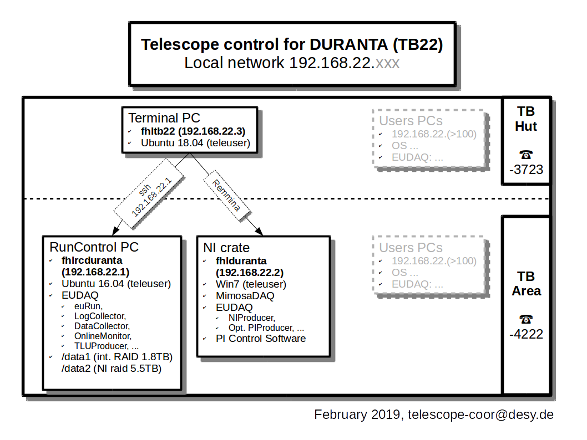

DATURA Telescope Configuration files
====================================

These files are to be used with the EUDET-type beam telescope "DURANTA" available in the DESY Test Beam Facility, Beamline TB22

### rc_start_scripts

The starting script  STARTRUN.datura opens the EUDAQ Run Control (euRun), the LogCollector, the DataCollector and the OnlineMonitor.
### configuration

EUDAQ conf files for autotrigger or beam trigger. These files contains the proper values for NIProducer and individual PMT control voltages.

### jtag_datura

TODO: JTAG files for programming the Mimosa26 sensors. The mcf files are written to be in C:/opt/jtag_datura. There is a corresponding link to these config files on the NI Crate (fhlduranta).

### ni_start_scripts

TODO: Important EUDAQ start scripts for testing only the telescope with beam or with autotrigger. These scripts should be placed in the binary folder C:/opt/eudaq/bin

### Computer infrastrucutre

